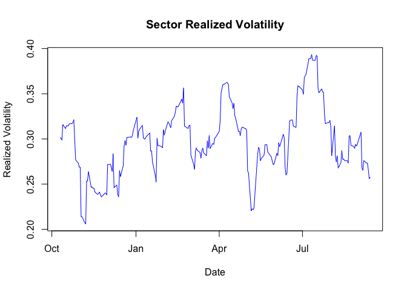
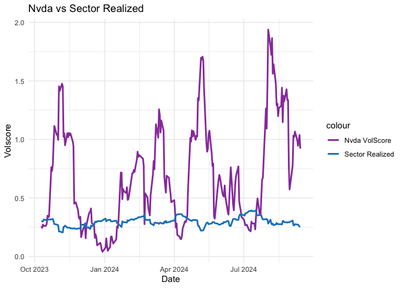
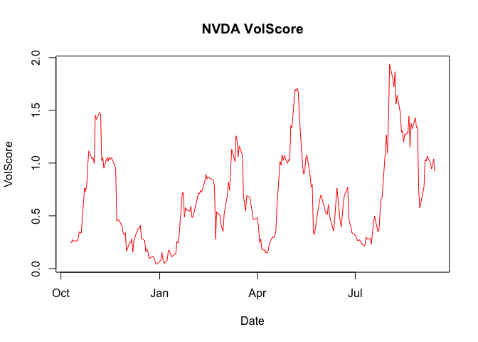
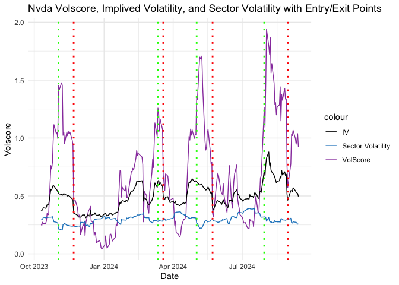

# Introduction

In recent times, retail options trading has surged, and according to a ([Barclays Report](https://amarketplaceofideas.com/wp-content/uploads/2021/08/Barclays_US_Equity_Derivatives_Strategy_Impact_of_Retail_Options_Trading.pdf)). Barclays report, the influx of retail traders has significantly affected market volatility, particularly in large-cap tech stocks. Retail traders have increasingly influenced implied volatility levels, creating opportunities for advanced strategies like short volatility trades. One way to take advantage of this is through a VolScore-based strategy, which measures the difference between a stock's implied volatility and its sector's realized volatility.

In this article, we explore how to use VolScore for trading NVIDIA (NVDA) options by comparing its implied volatility to that of its sector, composed of stocks like Microsoft (MSFT), Apple (AAPL), and AMD. Let’s dive into the strategy and its backtest results.

We will: 1. Gather implied volatilities and realized volatilities for the selected stocks. 2. Calculate the sector’s realized volatility. 3. Compare NVDA’s implied volatility to the sector’s realized volatility to generate a VolScore. 4. Develop a trading strategy based on VolScore thresholds. 5. Backtest the strategy and plot the results.


In this analysis, we explore a volatility-based trading strategy on NVIDIA (NVDA) options using a metric called **VolScore**. The VolScore measures how much higher (or lower) a stock's implied volatility is compared to the realized volatility of its sector. The sector consists of stocks like Microsoft (MSFT), Apple (AAPL), and AMD.

We will:
1. Gather implied volatilities and realized volatilities for the selected stocks.
2. Calculate the sector's realized volatility.
3. Compare NVDA's implied volatility to the sector's realized volatility to generate a VolScore.
4. Develop a trading strategy based on VolScore thresholds.
5. Backtest the strategy and plot the results.

# Step 1: Gathering Implied and Realized Volatilities

We have collected implied volatilities and realized volatilities for MSFT, AAPL, and AMD. The data is stored in JSON format.


``` r
knitr::opts_chunk$set(warning = FALSE, message = FALSE)

# Load libraries
library(jsonlite)
library(ggplot2)

# Simulated time-series data for implied and realized volatilities from JSON files
msft_data <- fromJSON("MSFT.json")
aapl_data <- fromJSON("AAPL.json")
amd_data <- fromJSON("AMD.json")

# Convert to data frames
msft_df <- as.data.frame(msft_data$data)
aapl_df <- as.data.frame(aapl_data$data)
amd_df <- as.data.frame(amd_data$data)
```

# Step 2: Calculating Sector Realized Volatility

We calculate the **sector realized volatility** by averaging the realized volatilities of MSFT, AAPL, and AMD.


``` r
# Calculate sector-wide realized volatility
# Convert realized volatility columns to numeric (if not already)

msft_df = na.omit(msft_df)
aapl_df = na.omit(aapl_df)
amd_df = na.omit(amd_df)


msft_df$realized_volatility <- as.numeric(msft_df$realized_volatility)
aapl_df$realized_volatility <- as.numeric(aapl_df$realized_volatility)
amd_df$realized_volatility <- as.numeric(amd_df$realized_volatility)

msft_df$implied_volatility <- as.numeric(msft_df$implied_volatility)
aapl_df$implied_volatility <- as.numeric(aapl_df$implied_volatility)
amd_df$implied_volatility <- as.numeric(amd_df$implied_volatility)

msft_df$price <- as.numeric(msft_df$price)
aapl_df$price <- as.numeric(aapl_df$price)
amd_df$price <- as.numeric(amd_df$price)


msft_df$date <- as.Date(msft_df$date)
aapl_df$date <- as.Date(aapl_df$date)
amd_df$date <- as.Date(amd_df$date)


summary(msft_df)
```

```
##       date            implied_volatility     price       realized_volatility
##  Min.   :2023-10-10   Min.   :0.1613     Min.   :326.7   Min.   :0.1250     
##  1st Qu.:2024-01-03   1st Qu.:0.1938     1st Qu.:378.0   1st Qu.:0.1705     
##  Median :2024-03-27   Median :0.2165     Median :409.4   Median :0.1892     
##  Mean   :2024-03-27   Mean   :0.2279     Mean   :403.4   Mean   :0.1918     
##  3rd Qu.:2024-06-20   3rd Qu.:0.2636     3rd Qu.:423.0   3rd Qu.:0.2141     
##  Max.   :2024-09-13   Max.   :0.3457     Max.   :467.6   Max.   :0.2713
```

``` r
# Calculate sector-wide realized volatility

sector_realized_vol <- rowMeans(cbind(msft_df$realized_volatility, aapl_df$realized_volatility, amd_df$realized_volatility), na.rm = TRUE)


sector_realized_vol = na.omit(sector_realized_vol)
summary(sector_realized_vol)
```

```
##    Min. 1st Qu.  Median    Mean 3rd Qu.    Max. 
##  0.2058  0.2734  0.2956  0.2976  0.3165  0.3936
```

``` r
# Plot the sector realized volatility
plot(msft_df$date, sector_realized_vol, type = "l", col = "blue", main = "Sector Realized Volatility", xlab = "Date", ylab = "Realized Volatility")
```

<!-- -->

# Step 3: Calculating VolScore for NVDA

Now, we calculate the **VolScore** for NVDA, which is the difference between NVDA's implied volatility and the sector's realized volatility, normalized by the sector realized volatility.


``` r
# Simulated NVDA data
nvda_data <- fromJSON("NVDA.json")
nvda_df <- as.data.frame(nvda_data$data)
nvda_df = na.omit(nvda_df)
# Convert 'implied_volatility' in nvda_df to numeric
nvda_df$implied_volatility <- as.numeric(nvda_df$implied_volatility)
nvda_df$date = as.Date(nvda_df$date)


# Calculate VolScore
nvda_df$VolScore <- (nvda_df$implied_volatility - sector_realized_vol) / sector_realized_vol
nvda_df$VolScore
```

```
##   [1] 0.25911963 0.24504680 0.27318219 0.26107159 0.26278263 0.28118220
##   [7] 0.34886623 0.33593256 0.34127584 0.76256463 0.73199414 0.78765807
##  [13] 0.97564071 1.11525125 1.04042688 1.04853343 0.99657040 1.45401088
##  [19] 1.41490680 1.47648142 1.45487798 1.02317504 1.05205103 0.95054729
##  [25] 1.05352060 1.01963509 1.05566304 1.03568629 1.05141537 0.98461807
##  [31] 0.94412456 0.45162581 0.46271193 0.39720986 0.33369372 0.32078467
##  [37] 0.33954072 0.16542307 0.24318803 0.24705368 0.28063789 0.15534638
##  [43] 0.26861060 0.35771020 0.37837995 0.38427552 0.41062987 0.28644594
##  [49] 0.26531081 0.15942551 0.18901705 0.16151819 0.09542627 0.11707560
##  [55] 0.09871148 0.05473755 0.04107436 0.07646779 0.15489835 0.08594149
##  [61] 0.04904109 0.08313478 0.16956800 0.17067045 0.13844621 0.11056301
##  [67] 0.14665291 0.25650633 0.24357957 0.30900106 0.71759019 0.71563575
##  [73] 0.48911870 0.57594573 0.55837573 0.54210138 0.59169983 0.48337951
##  [79] 0.49112118 0.53264642 0.66650770 0.71113312 0.71211364 0.73905051
##  [85] 0.72278606 0.82880733 0.89589122 0.85089259 0.86759201 0.86038403
##  [91] 0.83601003 0.77394150 0.27638053 0.53914451 0.50288660 0.41789834
##  [97] 0.38233647 0.35148243 0.52365390 0.69726660 0.81596612 0.74512524
## [103] 0.94180590 1.13042874 1.01517746 1.25817015 1.21089441 1.05943739
## [109] 1.16200514 1.07461448 0.68073042 0.60923031 0.54575803 0.69056673
## [115] 0.67187887 0.60074808 0.54595290 0.46385076 0.48148611 0.38653602
## [121] 0.24793204 0.28277498 0.18420868 0.16923096 0.15026325 0.14939445
## [127] 0.17323228 0.23878445 0.30069113 0.29320013 0.31210423 0.34182155
## [133] 0.57186305 1.01464614 0.98194395 1.07731686 1.02464993 1.07135584
## [139] 0.99732048 1.03257675 1.02564633 1.35298677 1.33364921 1.69856380
## [145] 1.68229643 1.70759727 1.67174272 1.43212727 0.97639679 0.89588246
## [151] 0.92118817 1.04542447 1.07495809 0.88227668 0.77332507 0.79431022
## [157] 0.34460093 0.32383871 0.59663490 0.65580694 0.69731607 0.66886025
## [163] 0.54402475 0.51911009 0.51316670 0.60696639 0.50724968 0.38413569
## [169] 0.35789948 0.47990985 0.63499468 0.76233731 0.44426269 0.39413723
## [175] 0.63249499 0.69288195 0.76949863 0.47328771 0.42750643 0.39479708
## [181] 0.33946630 0.31718777 0.29722599 0.26638302 0.27130230 0.22400789
## [187] 0.22240636 0.21488268 0.29816856 0.28236949 0.28213788 0.23192519
## [193] 0.34257781 0.43365531 0.49605384 0.35441602 0.35796749 0.51500839
## [199] 0.65722966 0.67276395 1.10943970 1.26494029 1.09354005 1.45503032
## [205] 1.93834872 1.79599780 1.72349303 1.86578453 1.56181180 1.64304399
## [211] 1.47567185 1.29201088 1.30572533 1.19959602 1.26997706 1.28550226
## [217] 1.44257524 1.14791984 1.37398478 1.32609067 1.42891003 1.33630557
## [223] 1.33786176 0.76328163 0.57354718 0.77472253 1.03262317 1.02113252
## [229] 1.06715379 0.99654573 0.94611287 0.98236017 1.03777682 0.92219172
```

``` r
class(nvda_df$VolScore)
```

```
## [1] "numeric"
```

``` r
ggplot(nvda_df) +
  aes(x = date) +
  geom_line(aes(y = VolScore, colour = "Nvda VolScore"), size = 1) +  # Line for Nvda VolScore
  geom_line(aes(y = sector_realized_vol, colour = "Sector Realized"), size = 1) +  # Line for Sector VolScore
  labs(x = "Date", y = "Volscore", title = "Nvda vs Sector Realized") +
  scale_color_manual(values = c("Nvda VolScore" = "#9941AC", "Sector Realized" = "#1C84C6")) +  # Define colors
  theme_minimal()
```

<!-- -->

``` r
# Plot NVDA VolScore
plot(nvda_df$date, nvda_df$VolScore, type = "l", col = "red", main = "NVDA VolScore", xlab = "Date", ylab = "VolScore")
```

<!-- -->

# Step 4: Developing a Trading Strategy

The trading strategy involves:
1. Entering a short volatility (straddle) position when the VolScore exceeds a certain threshold (1.2).
2. Exiting the position when the VolScore falls below a specified threshold (0.7) or after a fixed holding period.


``` r
# Initialize position tracking
# Trading parameters
entry_threshold <- 1.2
exit_threshold <- 0.7
holding_period <- 30  # in days

# Initialize position tracking
positions <- list()
cash <- 100000  # Starting cash
position_size <- 10000  # Trade size

entry_price <- 0
entry_date <- NA
pnl <- 0  # To track profit/loss

# Loop through NVDA data to simulate trades
for (i in 1:nrow(nvda_df)) {
  # Entry condition
  if (nvda_df$VolScore[i] > entry_threshold && is.na(entry_date)) {
    entry_date <- nvda_df$date[i]
    entry_price <- nvda_df$implied_volatility[i]
    positions[[length(positions) + 1]] <- list(
      type = "Entry", 
      date = entry_date, 
      price = entry_price, 
      VolScore = nvda_df$VolScore[i],
      pnl = NA  # No P/L for entry
    )
  }
  
  # Exit condition
  if (nvda_df$VolScore[i] < exit_threshold && !is.na(entry_date)) {
    exit_date <- nvda_df$date[i]
    exit_price <- nvda_df$implied_volatility[i]
    pnl <- position_size * (entry_price - exit_price)  # Calculate P/L
    cash <- cash + pnl
    positions[[length(positions) + 1]] <- list(
      type = "Exit", 
      date = exit_date, 
      price = exit_price, 
      VolScore = nvda_df$VolScore[i],
      pnl = pnl  # Include P/L for exit
    )
    
    # Reset entry after exit
    entry_date <- NA
    entry_price <- 0
  }
}
```

# Step 5: Plotting the Final Results

We now plot the **entries** and **exits** on the same chart with **VolScore** and **implied volatility** to visualize the strategy.


``` r
# Ensure the relevant columns are numeric
nvda_df$VolScore <- as.numeric(nvda_df$VolScore)
nvda_df$realized_volatility <- as.numeric(nvda_df$realized_volatility)

positions_df <- do.call(rbind, lapply(positions, function(x) as.data.frame(x, stringsAsFactors = FALSE)))


# Ensure the positions dataframe also has numeric VolScore
positions_df$VolScore <- as.numeric(positions_df$VolScore)


# Plotting VolScore with realized volatility, sector volatility, and vertical lines for entry/exit points
ggplot(nvda_df) +
  aes(x = date) +
  geom_line(aes(y = VolScore, colour = "VolScore"), size = 0.5) +  # Line for VolScore
#  geom_line(aes(y = realized_volatility, colour = "Realized Volatility"), size = 0.5) +  # Line for Realized Volatility
  geom_line(aes(y = sector_realized_vol, colour = "Sector Volatility"), size = 0.5) +  # Line for Sector Volatility
  geom_line(aes(y = implied_volatility, colour = "IV"), size = 0.5) + 
  # Add vertical lines for Entry points
  geom_vline(data = subset(positions_df, type == "Entry"), aes(xintercept = as.numeric(date)), 
              color = "green", size = 1, linetype = "dotted") +
    # Add vertical lines for Exit points
  geom_vline(data = subset(positions_df, type == "Exit"), aes(xintercept = as.numeric(date)), 
             color = "red", size = 1, linetype = "dotted") +
  
  labs(x = "Date", y = "Volscore", title = "Nvda Volscore, Implived Volatility, and Sector Volatility with Entry/Exit Points") +
  scale_color_manual(values = c("VolScore" = "#9941AC", "Realized Volatility" = "#FF5733", "Sector Volatility" = "#1C84C6", "IV" = "black")) +  # Custom colors
  theme_minimal()
```

<!-- -->

``` r
positions_df
```

```
##    type       date     price  VolScore      pnl
## 1 Entry 2023-11-02 0.5246691 1.4540109       NA
## 2  Exit 2023-11-22 0.3503089 0.4516258 1743.602
## 3 Entry 2024-03-12 0.6294907 1.2581702       NA
## 4  Exit 2024-03-19 0.5004700 0.6807304 1290.207
## 5 Entry 2024-05-02 0.6229188 1.3529868       NA
## 6  Exit 2024-05-23 0.3948357 0.3446009 2280.832
## 7 Entry 2024-07-30 0.7206185 1.2649403       NA
## 8  Exit 2024-08-30 0.4633520 0.5735472 2572.665
```

# Conclusion

This report demonstrates how to calculate a VolScore and develop a simple short-volatility trading strategy based on implied and realized volatilities. The strategy involves entering positions when the VolScore is high and exiting when the VolScore drops or after a set holding period. The backtest results show the P&L for each trade and the overall performance of the strategy.
